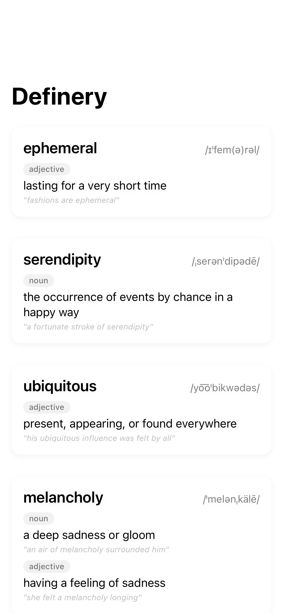
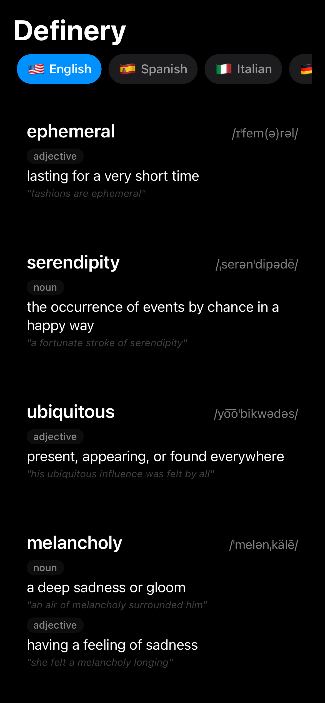
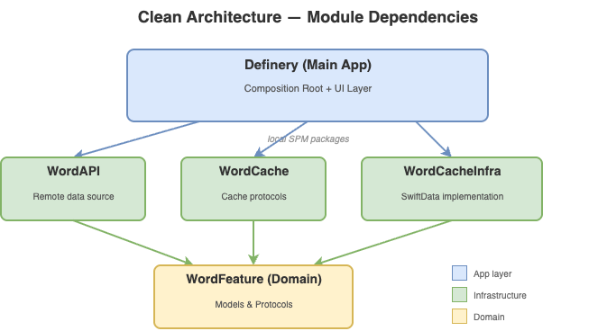
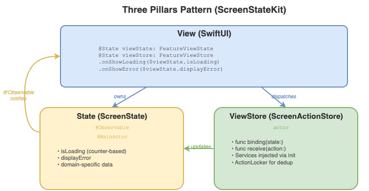

# Definery


[](https://github.com/anthony1810/Definery/actions/workflows/test-ios.yml)
[](https://github.com/anthony1810/Definery/actions/workflows/test-macos.yml)
[](https://github.com/anthony1810/Definery/actions/workflows/testflight.yml)

Your personal dictionary companion for language learning. Definery helps you discover, save, and master new vocabulary with an intuitive interface and smart quiz features.

> This project showcases [ScreenStateKit](https://github.com/anthony1810/ScreenStateKit)'s Three Pillars pattern in a production iOS app with clean architecture and offline-first capability.

---

## Screenshots

| Light | Dark |
|:-----:|:----:|
|  |  |

---

## Features

**Home**
- Browse random words with pull-to-refresh
- Infinite scroll pagination
- Multi-language support (English, Spanish, French, German, Italian, Portuguese, Chinese)
- Save words to your personal library
- Offline fallback with cached words

**Library**
- View and manage saved words
- Quick delete functionality
- Detailed word view with meanings and examples

**Quiz Mode**
- Timed vocabulary challenges
- Multiple choice questions from your library
- Score tracking and progress

---

## Tech Stack

| Category | Technology |
|----------|------------|
| UI | SwiftUI |
| Persistence | SwiftData |
| State Management | [ScreenStateKit](https://github.com/anthony1810/ScreenStateKit) |
| Concurrency | Swift async/await, Actors |
| Testing | Swift Testing, [swift-snapshot-testing](https://github.com/pointfreeco/swift-snapshot-testing) |
| Time Testing | [swift-clocks](https://github.com/pointfreeco/swift-clocks) |
| CI/CD | GitHub Actions |

---

## Architecture

Definery follows **Clean Architecture** with local SPM packages:

<p align="center">
  
</p>

### Three Pillars Pattern (ScreenStateKit)

Each feature follows the State + ViewStore + View pattern:

<p align="center">
  
</p>

**Key Patterns:**
- **Offline-First**: Remote with local fallback
- **Protocol-Driven**: All dependencies injected via protocols
- **Actor-Based**: Thread-safe ViewModels

---

## Getting Started

1. **Clone the repository**
   ```bash
   git clone https://github.com/anthony1810/Definery.git
   cd Definery
   ```

2. **Open in Xcode**
   ```bash
   open Definery.xcodeproj
   ```

3. **Resolve packages** - Xcode will automatically fetch dependencies

4. **Build and run** - Select iOS or macOS target

---

## Project Structure

```
Definery/
├── Modules/
│   ├── WordFeature/                 # Domain layer SPM package (models, protocols)
│   ├── WordAPI/                     # API layer SPM package + tests
│   ├── WordCache/                   # Cache layer SPM package + tests
│   └── WordCacheInfrastructure/     # SwiftData infrastructure SPM package + tests
├── Definery/                        # Main app (composition, UI)
└── DefineryTests/                   # App-level tests (snapshots, integration)
```

---

## Testing

Run tests via Xcode or command line:

```bash
# Core modules (macOS via swift test)
swift test --package-path Modules/WordAPI
swift test --package-path Modules/WordCache
swift test --package-path Modules/WordCacheInfrastructure

# iOS app tests (snapshots, integration)
xcodebuild test -project Definery.xcodeproj -scheme Definery-iOS -testPlan Definery-iOS
```

**Testing Approach:**
- TDD with Swift Testing framework
- Memory leak detection on all components
- Snapshot tests for UI verification
- Testable time with swift-clocks

---

## Roadmap

### Completed
- [x] Domain layer (WordFeature)
- [x] API layer with remote loader
- [x] Cache layer with local fallback
- [x] SwiftData infrastructure
- [x] Composition root
- [x] Home UI with language filter

### In Progress
- [ ] Library UI (view/delete saved words)

### Planned
- [ ] Quiz mode with timer
- [ ] Word detail view
- [ ] Search functionality
- [ ] Widget support
- [ ] Localization

---

## APIs

| Purpose | Provider |
|---------|----------|
| Random Words | [random-word-api](https://random-word-api.herokuapp.com) |
| Definitions | [Wiktionary API](https://en.wiktionary.org) |

---

## Resources

- [ScreenStateKit](https://github.com/anthony1810/ScreenStateKit) - State management
- [swift-clocks](https://github.com/pointfreeco/swift-clocks) - Testable time
- [swift-snapshot-testing](https://github.com/pointfreeco/swift-snapshot-testing) - UI snapshots

---

## License

This project is licensed under the MIT License - see the [LICENSE](LICENSE) file for details.
